.. DisCVR documentation master file, created by
   sphinx-quickstart on Wed May  8 11:31:09 2019.
   You can adapt this file completely to your liking, but it should at least
   contain the root `toctree` directive.

Welcome to DisCVR's documentation!
==================================

DisCVR is a viral detection tool which allows the identification of known human viruses in clinical
samples from high-throughput sequencing (HTS) data. It uses the k-mers approach in which the
sample reads are decomposed into *k*\-mers and then matched against a virus k-mers database. The
built-in database is a list consists of all *k*\-mers (*k*\=22) that are not low-complexity and only found in
the viral genomes but not in the human genome. Each *k*-mer is assigned the taxonomic label of all
viral genomes that contain that *k*\-mer in the NCBI taxonomy tree. These assignments are made at the
species and strains taxonomic level.

DisCVR has a user-friendly Graphical User Interface (GUI) which runs the analysis on the sample and
shows the results interactively. It enables the visualisation of the coverage of the virus genomes found
in the sample in order to validate the significance of the results. In addition, DisCVR is a generic tool
which can be used with other non-human viruses by facilitating the build and use of customised kmers
database.

DisCVR is designed to run on machines with low processing capacity and small memory.


.. toctree::
   :maxdepth: 2
   :caption: Contents:


Requiremenents
==============

* **Disk Space**\: DisCVR.jar requires **~700MB space** for installation with the built-in databases. It is
  recommended to have space for 2x sample size when using DisCVR for classification as the
  process involves writing temporary files to disk. When building a customised database, the
  amount of space depends on the size of the viral sequences and the *k* size. For example,
  extracting *k*\-mers of size 32 from the human genomes generates a file that is 80GB in size. If
  the viral data sequences are 3GB in size, then the minimum disk space needed to build a
  customised database is 200GB.
* **Memory**\: DisCVR runs efficiently on a machine with **4GB RAM**, which is the current standard
  for PCs. It is much faster on machines with higher RAM such as 8GB RAM. However, the
  amount of RAM depends on the number of the sequences used and the size of the k-mer. The
  larger the dataset and the k-mer, the larger the amount of RAM needed. Therefore, in the
  case of “out of memory” errors, the Java heap space should be increased.


Installation
============

* Operating System: DisCVR runs on both Windows and Linux platforms. To use DisCVR, the
  users need first to download the appropriate folder for their operating system.
  
  * `Windows OS (771Mb) <http://bioinformatics.cvr.ac.uk/DisCVR/Downloads/DisCVR_Windows.zip>`_
  * `Linux OS (786Mb) <http://bioinformatics.cvr.ac.uk/DisCVR/Downloads/DisCVR_Linux.tar.gz>`_
  * `Mac OS (793Mb) <http://bioinformatics.cvr.ac.uk/DisCVR/Downloads/DisCVR_Mac.tar.gz>`_ 
  * `Command-line for multiple classifications (645Mb) <http://bioinformatics.cvr.ac.uk/DisCVR/Downloads/DisCVR_CL.jar>`_
  * `View source codes on GitHub <https://centre-for-virus-research.github.io/DisCVR/>`_ 
  
* Java: Java (1.8 or above) must be installed and the full path to the jre\bin folder should be
  included in the system variables. Java can be downloaded from:
  `Link to Oracle <http://www.oracle.com/technetwork/java/javase/downloads/jre8-
  downloads-2133155.html>`_
* DisCVR.jar: After downloading the DisCVR zipped folder, it is recommended to use a tool, such
  as 7-zip, to unzip the Windows OS version and extract all files to a local directory. For Linux
  and Mac version, open a command prompt and move to the location of the zipped folder.
  Type the following commands to unzip the folder:
  ``tar -xzvf DisCVR_Linux.tar.gz``
  
  This creates a folder, called DisCVR. The contents of DisCVR consists of one jar: DisCVR.jar and
  a lib folder which are used to run the classification. The script file: downloadDataAndRefSeq.sh
  and the folders: bin, customisedDB, and TestData which are needed to build a customised
  database.
  
  **IMPORTANT**\: The full path to DisCVR directory must NOT contain space nor the dot ‘.’ to avoid
  conflict with the files naming during the classification process.
* Dependencies: DisCVR uses external libraries such as KAnalyze, for k-mers counting, and
  JFreechart packages, for graphs plotting. It makes use of Tanoti, a Blast-based tool for
  reference assembly. These are 10 files in total and they are in the lib folder. It is important
  not to alter the lib folder or its contents and to ensure that it is in the same path as the jar file.


Testing
=======

To test if the tools are installed properly, open a command prompt and type the following:

* To know what Java version is installed: ``java –version``. This should state ``java version 1.8.0_<some number>``
  
* To see if Java is added to the path: ``java``.   If the jre\bin is not added to the path, you will see the following message:
  ``java is not recognized as an internal or external command, operable program or batch file``.

* Download the test samples `here <http://bioinformatics.cvr.ac.uk/DisCVR/Downloads/TestSamples.zip>`_


Quick GUI overview
==================

The screenshots below provide an overview demonstration of DisCVR GUI and how to use it to classify a clinical sample from HTS data and validate the results using reference genome alignment.

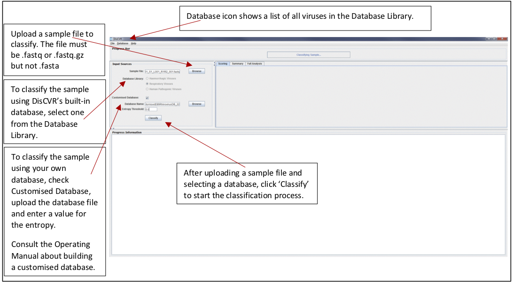
   
   Figure1a: Guide for the sample classification process using DisCVR GUI.
   
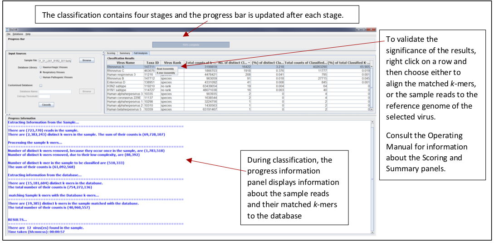
   
   Figure1b: Guide for the result validation using DisCVR GUI


DisCVR Built-in Databases
=========================

DisCVR tool has three virus *k*\-mers (k=22) databases which are built into the DisCVR.jar:

1. Human Hemorrhagic virus dataset (hemorrhagic dataset)
2. Human Respiratory virus dataset (respiratory dataset)
3. Human Pathogenic viruses dataset (pathogenic dataset)

The hemorrhagic and respiratory datasets consist of a list of selected circulating viruses. 
The pathogenic datatset consist of a list of all human pathogenic viruses identified as biological agents by the 
Health and Safety Executive (HSE) in the UK available at: `http://www.hse.gov.uk/pubns/misc208.pdf <http://www.hse.gov.uk/pubns/misc208.pdf>`_

Both the hemorrhagic and respiratory datasets overlap with the HSE database but are smaller in size and therefore are faster to use in classification.
Moreover, each dataset has a list of viral reference genomes that is associated with the viruses in the database. The reference genomes are used in the validation stage of DisCVR.
Information about the viruses in the databases can be obtained from the Database icon on the menu bar from the DisCVR GUI. The information includes the virus rank on the taxonomy tree, 
the number of sequences used in the database build to represent it, and the accession number of its reference genome. Segmented viruses have their reference genome accession number listed 
in decreasing order of the segment size. The accession numbers of the reference genomes are linked to their webpages on the NCBI, which can be viewed by clicking on the reference genome accession.

DisCVR Classification
=====================

The DisCVR GUI can be used to carry out a single sample classification. To launch the DisCVR GUI, either double click on DisCVR.jar, or 
open a command prompt and type the following commands:

.. code-block:: bash

   cd full/path/to/DisCVR folder
   java –jar full/path/to/DisCVR.jar


Once DisCVR is launched, there are 4 panels in the graphical interface:

1. Progress Bar: shows the progression of the classification process.
2. Input Sources: allows the user to choose the sample file and a *k*\-mers database for classification.
3. Classification Results: shows the classification output in three sub-panels.
4. Progress Information: updates the user about classification output.

To start a classification process, the user needs to first select the sample file they wish to 
investigate. Currently, DisCVR supports .fasta, .fa, .fastq, and .fq formats. It allows for the selection 
of one file hence, for paired-end files, it is recommended to concatenate both files. The second step is to 
choose the database for the classification. The default setting is to select one of the three built-in databases. 
This sets the *k*\-mer size to 22 and removes all sample *k*\-mers with entropy ≤ 2.5. On the other hand, if the user 
chooses to use a customised database for the classification, then the box next to the :ref:`Customised Database` label 
must be checked. The fields for this selection are then activated for the user to upload the customised database 
file, which MUST be in the customisedDB folder that is in the same path as DisCVR.jar. The *k*\-mer size for the 
classification is extracted from the database name and the threshold to filter out low-entropy *k*\-mers from the 
sample should be entered in its corresponding field. The entropy threshold should be the same value used in the 
build of the customised database which is recommended to be in the range of [0, 3.0]. If the users choose not to 
specify a value for the entropy threshold then the default value of 2.5 is displayed in the field and used in the 
classification.

Once, the database library is selected, the user clicks the classify button to start the classification process.


There are 4 stages in the classification process and the progress bar is updated after the completion of each stage. 
Messages in relation to the output of each stage are displayed in the progress information panel. 
This includes the number of reads in the sample, the number of distinct *k*\-mers and their total counts in 
the database and the sample file, the number of sample *k*\-mers after removing single copies and low entropy 
*k*\-mers, and the number of classified *k*\-mers and their total counts. The final message shows the number of 
viruses with classified *k*mers found in the sample and the time taken to finish the classification process. 
Figure 1 shows screenshots of the sample classification process using the DisCVR GUI.


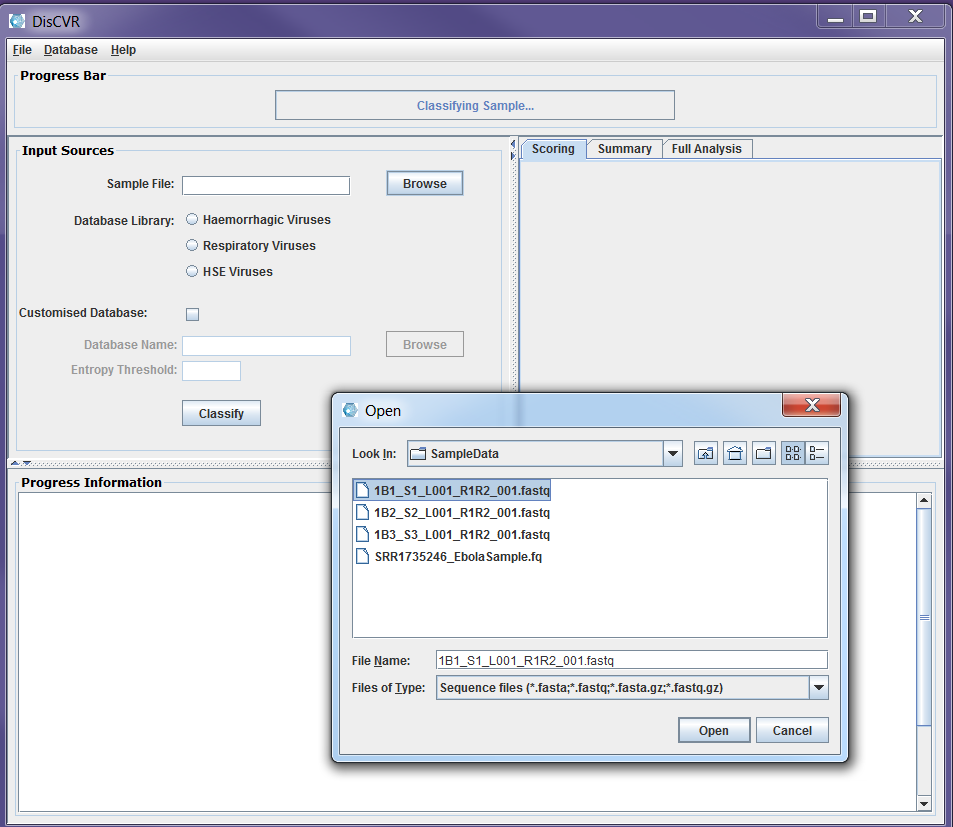

   Figure2a: Screenshots of a sample classification process using DisCVR GUI. First the sample file is uploaded

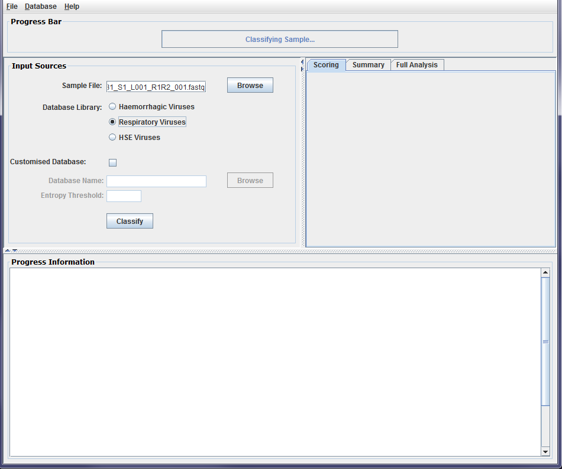

   Figure2b: Screenshots of a sample classification process using DisCVR GUI. The *k*\-mers database is then selected from the DisCVR database library
   
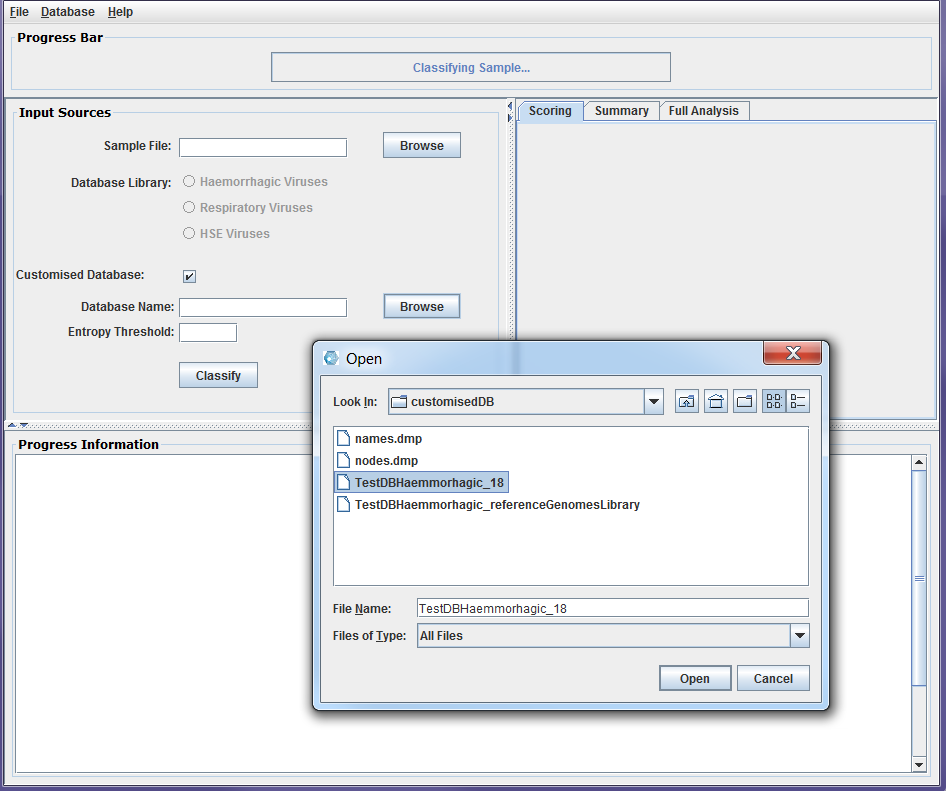
   
   Figure2b: Screenshots of a sample classification process using DisCVR GUI. The *k*-mers database is then selected from the user customised database*


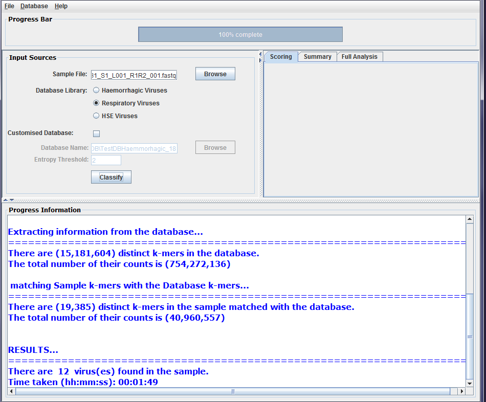

   Figure2b: Screenshots of a sample classification process using DisCVR GUI. The classification results are displayed


Classification Output
=====================

At the end of the classification process, the progress information panel states the number of viruses with matched *k*-mers to the database. 
Detailed information about the classification results are displayed on the centre panel.

The classification results panel consists of three sub-panels: Scoring, Summary, and Full Analysis. Once the classification is completed, a bar 
chart showing up the top three viruses is displayed on the scoring panel. These are the viruses with the most number of classified distinct *k*\-mers 
found in the sample. The chart shows for each virus, the number of distinct *k*\-mers that are specific to the virus as well as the number of shared 
*k*\-mers with other viruses in the sample, which are referred to as non-specific *k*\-mers. The Summary panel gives a list of the viruses found in the 
sample along with their number of specific and non-specific distinct *k*-mers. The Full Analysis panel shows a table with taxonomic and detailed 
information about the viruses with classified *k*\-mers from the sample. The results are shown in the table such that the first row shows the virus 
with the highest number of *k*\-mers found in the sample. However, the users can click on any column heading to sort out the results in the table 
according to the information in the column. The full analysis table consists of 8 columns:

1. Virus Name: the scientific name for the virus taking from the NCBI names.dmp file.

2. Taxa ID: the taxonomy identification for the virus in the NCBI taxonomy tree.

3. Virus Rank: the rank of the virus according to the NCBI nodes.dmp file.

4. Total counts of *k*\-mers in DB: the total counts of *k*\-mers that represent the virus in DisCVR’s
database.

5. No. of distinct Classified *k*-mers: the number of distinct *k*\-mers that represent the virus in the
sample after removing single copies and low entropy *k*\-mers and matched with the *k*\-mers
database.

6. (%) of distinct Classified *k*\-mers: the percentage of distinct classified *k*\-mers that represent the
virus in the sample.

7. Total counts of Classified *k*\-mers: the total number of *k*\-mers that represent the virus in the
sample; some distinct *k*\-mers can occur in the reads multiple times.

8. (%) of total classified *k*\-mers: the percentage of the total number of *k*\-mers that represent the
virus in the sample’s total number of *k*\-mers.

The table can be saved as .csv file from the File icon on the GUI tool bar. Figure 2 shows screenshots
of the classification results sub-panels.

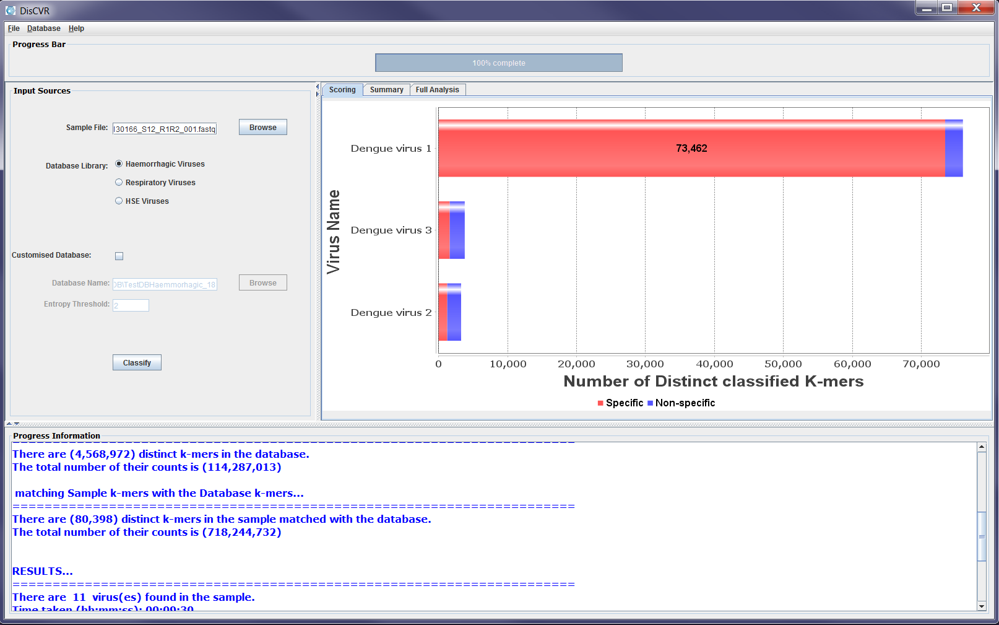

   Figure3a: Screenshots showing sample classification output on the results sub-panels. The scoring panel shows the three viruses with the highest number of matched *k*\-mers

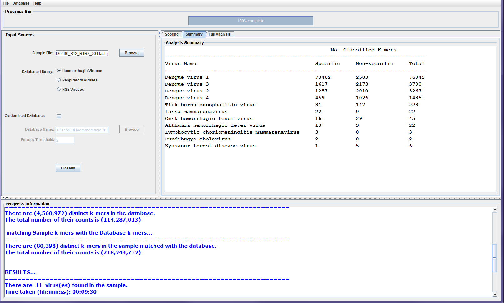

   Figure3b: Screenshots showing sample classification output on the results sub-panels. The summary panel
   
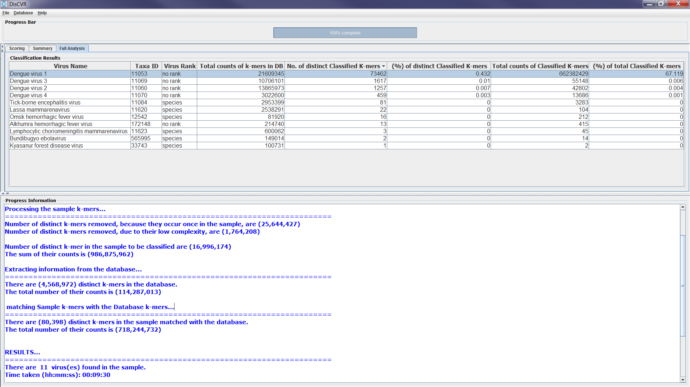
   
   Figure3c: Screenshots showing sample classification output on the results sub-panels. The full analysis panel with detailed information about the viruses found in the sample


Output Validation
=================

DisCVR allows the validation of the classification output using the reference-assembly technique to assess significance of matches. 
During the build of the virus *k*\-mer database in DisCVR, a library that contains the complete reference genomes of some of the viruses, 
which are represented by *k*\-mers in the database, is generated. The tool allows two validations using the extracted reference genome library:

1. *k*\-mer Assembly: maps all classified *k*\-mers to a reference genome.

2. Read Assembly: maps all sequence reads to a reference genome using Tanoti (a BLAST-guided
aligner).

The validation takes place from the Full Analysis panel when the user right-clicks on the virus, which they wish to validate. A list with two 
items: *k*\-mer Assembly and Read Assembly appears and once the user makes a selection, the reference-assembly starts. When the alignment is 
finished, a line graph showing the coverage and depth of the sequence data in the sample is displayed. A full coverage of the reference genome 
indicates strong evidence for the presence of the virus in the sample. The graphs can be saved as a PNG file for future reference. Figure 3 
shows an example of the validation stage and its outputs.

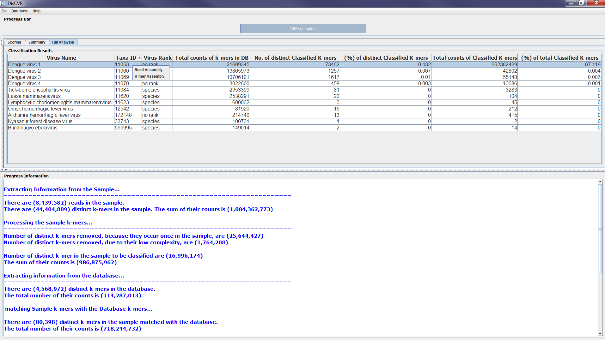

   Figure4a: Screenshots showing how to assess the significance of matches from the sample classification results. Right-clicking on a row from the Full Analysis table provides a pop-up list of choices to start reference assembly

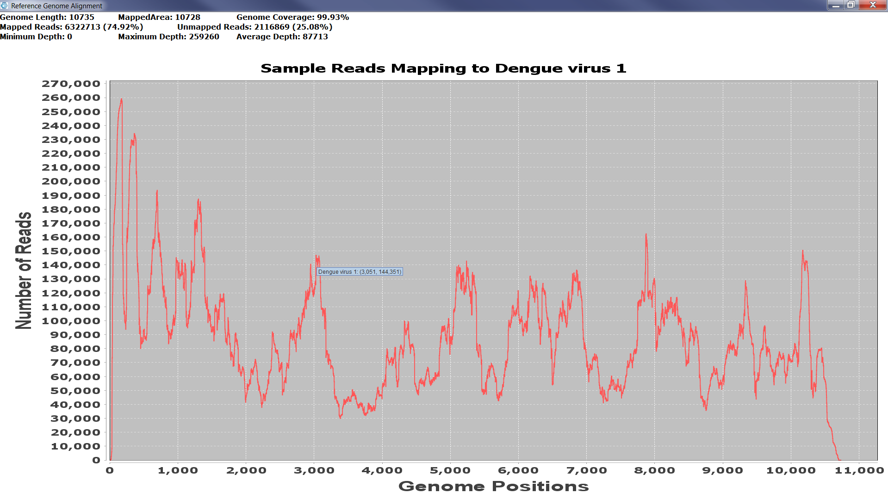

   Figure4b: Screenshots showing how to assess the significance of matches from the sample classification results. Right-clicking on a graph e.g. Read-Assembly graph shows the number of reads at a certain reference genome position.

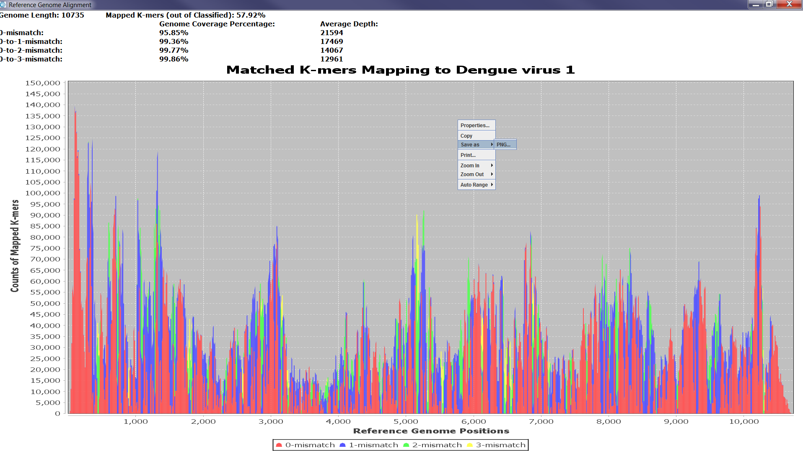
   
   Figure4c: Screenshots showing how to assess the significance of matches from the sample classification results. Right-clicking on a graph e.g. *k*\-mer assembly allows the users to save it as a PNG file.

DisCVR Command Line
===================

DisCVR can be used to classify multiple samples at once using the command line. In this case, a folder is generated containing the 
results for each sample in a separate .csv file. The results consist of information about the reads in the sample and the full analysis 
of matched *k*-mers. 
The jar called DisCVR\_CL.jar is used to run classifications on more than one file. Refer to the Installation section to download and install the jar and ensure that it is on the same path as *DisCVR.jar* and the *lib* folder. 
The following command can be used to run DisCVR_CL.jar to classify multiple files.

.. code-block:: bash

    java –jar full/path/to/DisCVR_CL.jar <samples folder> <k> <file format> <Database name> <database option> <entropy threshold>

<samples folder>: is the full path to the folder which contains sample files to be classified.  
<k>: is the *k*-mer size.  If using the DisCVR built-in database, use 22
<file format>: is the format of the sample files e.g. fastq  
<database name>: is the name of the database to be used in the classification. If DisCVR’s built-in database is to be used then use *HaemorrhagicVirusDB_22*, *RespiratoryVirusDB_22*, or *HSEVirusDB_22*. In case of a customisedDB, the full path to the database file must be provided.  
<database option>: if it is one of DisCVR’s database then use *BuiltInDB* and if it is a customised database file then use *customisedDB*.  
<entropy threshold>: is the threshold to use to remove low- entropy *k*-mers. If using DisCVR’s built-in database, for consistency use 2.5.

Using the command line, DisCVR enables the analysis of multiple clinical samples, however 
validation of the results via reference genome alignment is not available at this stage.

Building custom databases
=========================

* If you want to build a customised database, the following NCBI tools and files must be
  downloaded and installed:

  * The NCBI eutilities tools are used to download data. The tools can be found on `NCBI eutlities <ftp://ftp.ncbi.nlm.nih.gov/entrez/entrezdirect/>`_. The full
    path to the edirect folder should be added to the system variables
    
  * The NCBI taxdump files are used for taxonomy information retrieval when building a
    customised database. The file can be downloaded from `NCBI taxonomy
    <ftp://ftp.ncbi.nlm.nih.gov/pub/taxonomy/>`_. The file taxdump.tar.gz
    should be downloaded and unzipped. The two files: names.dmp and nodes.dmp MUST
    be copied to the customised database folder: customisedDB which is in the same path
    as DisCVR.jar.

* To see if eutilities tools is added to the path: ``esearch``
  This should state``Must supply -db database on command line```


Customised Database
===================

DisCVR allows the users to build their own customised database from a list of viruses that are of interest. This section explains 
the steps to generate the users customised database files. Refer to the Installation section to ensure the required tools are downloaded 
and installed properly before proceeding to customise your *k*-mers database. The NCBI files, i.e. *names.dmp* and *nodes.dmp*, must be copied 
to the *customisedDB* folder. The NCBI website ([https://www.ncbi.nlm.nih.gov](https://www.ncbi.nlm.nih.gov)) is used for downloading the data. The following table lists all 
the files and parameters needed to build a customised database.

====================== ====================================================================================================
Files/Parameters       Description                                                                                        
====================== ====================================================================================================
Input File             A file containing information about the set of viruses to build the database from                  
NCBI Taxdump Files     Two files (*names.dmp* and *nodes.dmp*) to be downloaded into the customisedDB folder                  
Host genomes file      A fasta file containing the host DNA sequences                                                     
Entropy threshold      A number in the range [0,3] to act as a low-complexity threshold                                   
Data Location          The path to the folder containing the data to build the database from                              
Name of the database   The given name to the customised database. This should be a single word that does NOT contain (_)  
K size                 The length of *k*-mers to be used in the build of the database.                                    
Number of threads      The number of threads to use during the build of the database.                                     
File counter           The number of virus files to process at one time during the build of the database.                 
====================== ====================================================================================================

*Table 1: Files and parameters needed to build DisCVR’s customised database*

The process starts by providing a list of the viruses of interest and the information of their complete genomes, if they exist. This input is a tab-delimited 
file which contains the taxonomy ID of the virus and the accession number for its reference sequence. In DisCVR, the three built-in databases use only human 
viral sequences at the species and subspecies levels on the taxonomy tree. However, the customised-database does not require the viruses to be of a particular 
rank in the taxonomy tree nor the host to be human. In addition, the input file should not have duplicate taxonomy IDs but multiple taxonomy IDs in the list 
can have the same reference sequence. Table 2 shows an example of the input file.

**IMPORTANT:** the accession number of the virus reference sequence MUST be the exact accession number provided in the header of the reference sequence.

There are three steps to build the customised database which must be executed sequentially:  

1. Data Download; which involves obtaining the data required to build the two database files.

2. Generating the reference genome library file using the information of the reference sequences.

3. Generating the virus *k*-mers database from the downloaded sequences.

====== =======================  ============
Taxid  Accession Number         Description
====== =======================  ============
121791 NC_002728.1              The virus taxonomy ID is followed by the accession number of the virus’s reference sequence.
499556 NC_010563.1,NC_010562.1  It is a segmented virus. The accession numbers for the reference sequences segments are comma-separated and listed in order so that the first segment is the largest.
11598                           Only the virus taxonomy ID is provided because the virus does not have a reference sequence.
====== =======================  ============

*Table 2: An example of the input file for the customised database builds stage. Left column shows an example of a line in the input file. Right column explains the components of the line.*


Data Download
-------------


The first step in building the database is to obtain the viral sequences for the viruses of interest. The script downloadDataAndRefSeq.sh 
uses the eutilities tools to download the data from the NCBI using the following command:

.. code-block:: bash

   bash downloadDataAndRefSeq.sh <taxIDs_List> <outputDir>

<taxIDs_List>: the input file which contains the virus taxonomy IDs and their reference sequence information.
<outputDir>: the name of the directory for the downloaded data.


After executing the script, the output directory will have two sub-directories:

i.  **DataSeq** which contains the data to be used to build the virus *k*\-mers file, and
ii. **RefSeq** which contains the data to create the reference sequence library file.

Each file in both directories includes in its name the taxonomy ID (taxID) of the virus whose data is
contained in the file. The **DataSeq** directory has two corresponding files for each taxID:

i.  Virus_taxID.fa is a fasta file which contains all complete and partial viral sequences for the virus with the taxID, and
ii. Virus\_taxID\_Info which contains information for the sequences in the corresponding fasta file. The first line states the number of sequences found on NCBI for the taxID followed by information for each sequence. This includes Accession number, title, gi header, update date, length of the sequence, the subtype, and strain. 

Similarly, the **RefSeq** directory contains files for each taxID which has information of its reference sequence in the input file. 
The files which are called Virus\_taxID\_RefSeq.fa are fasta files that contain one or more sequences (in the case of segmented viruses). 
Information files are used to identify segmented viruses, in the case of **RefSeq**, and to filter out shared sequences, in the case of **DataSeq**.

**IMPORTANT:** ensure that the files in both RefSeq and DataSeq folders are NOT empty. If any of the file are empty, re-run the data download 
script with an input file that contains only the information for the taxIDs with empty files.

Database Files Generation
-------------------------

Java programs are used to generate the two files in the database. These Java programs are found in the folder called 'bin'.

Reference Genome Library
------------------------

The reference genome library file is used in the validation stage of DisCVR and it contains the reference sequences for the viruses 
in the input file. The reference sequences are identified in the input file by their accession numbers and the corresponding sequences are 
downloaded in the RefSeq directory. The Java program *GenomesLibrary* is used to generate the reference genome library using the following command:

.. code-block:: bash

   java –cp ./bin customdatabase.GenomesLibrary <taxIDs_List> <database_Name> <RefSeq_Dir>

<taxIDs_List>: the input file which contains the virus taxonomy IDs and their reference sequence information.
<database_Name>: is the name to be given to the customised database
< RefSeq_Dir >: is the full path of the RefSeq folder which contains all downloaded data for the reference sequences.

The output file is called: databaseName_referenceGenomesLibrary and it is in the **RefSeq** folder. Each line in the file consists of 
a virus taxonomy ID, the header, and the sequence of its complete genome. The delimiter "@" is used to separate the three components. 
In the case where the reference sequence is a concatenation of multiple segments, the headers are separated by a comma and the sequences 
are separated by a sequence, 300 in length, of the letter N. For the viruses which share the same reference sequence (i.e. species level 
and their sublevels are assigned the same reference sequence) then their taxonomy IDs are separated with a pipe sign "|".

The output file MUST be copied to the *customisedDB* folder to be used for DisCVR’s validation when using the customised *k*-mers database.

Virus *k*\-mers database
------------------------

The last step to build the customised database is to generate the file which contains the virus *k*-mers. In the generation of DisCVR’s 
built-in database files, a filtering step was used to remove shared sequences between a virus and its ancestors in the taxonomy tree. 
This is an optional step which can be used in the build of the customised database to reduce redundancy in the data and to increase virus 
specificity.

Data Filtering (Optional)
-------------------------

The filtering process removes shared sequences from the ancestors’ data. For example, if sequences are found in both the strain and the species 
levels, then they are removed from the sequences at the species level. It is recommended to keep a copy of the data in the **DataSeq** directory 
before executing this step to avoid loss of data. The NCBI dump files (i.e. names.dmp and nodes.dmp) are used in this step and they MUST be 
included in the customisedDB folder. The Java program DataSequences is used to filter the downloaded sequences using the following commands:

.. code-block:: bash

   mkdir <DataSeq_filtered>
   cp -r <DataSeq_Dir> <DataSeq_filtered>
   java –cp ./bin customdatabase.DataSequences <DataSeq_Dir> <genomes_file> <database_Name>

< DataSeq_Dir>: is the full path for the DataSeq folder which contains the viruses’ data (fasta and Info files).
<DataSeq_filtered>: is the full path for the folder which contains the filtered data.
<genomes_file>: is the full path for the referenceGenomeLibrary which is generated from the previous step.
<database_Name>: is the name to be given to the customised database.


After executing the program, the sequence files (i.e. fasta files) for the viruses which are ranked at a higher taxonomic level to 
other sequences in the **DataSeq** directory are modified, if they contain shared sequences. The output file: databaseName\_lineageID.txt 
shows, per line, the taxID of a virus followed by the taxIDs of higher taxonomic level. In addition, a file which contains summary 
information about the viruses in the database such as their rank in the taxonomy tree and the number of sequences per virus, after 
filtering, is generated. The file is called: databaseName_DataInformation.csv.

Finally, an output file called: databaseName_allSeqData is generated and it contains all the sequences, after filtering, from 
all the data files in the directory. The three output files can be found in the **DataSeq** directory.

*k*\-mers database file
------------------------

The final step in the customised database build is to generate the virus *k*\-mers database file from the downloaded viral sequences. 
In this step, *k*-mers from the viral sequences and from the host genomes are extracted. Low entropy and host *k*-mers are then removed 
from the virus *k*-mers. The remaining set of virus *k*\-mers are assigned the taxIDs of all the viruses which are represented by these 
*k*\-mers. Table 3 shows an example of the virus *k*\-mer database file.

=================== =====  ==================  
*k*\-mer            count  taxids
=================== =====  ==================
AAAAACAAGAATGGACAC  2      11620 1 
AAAAACAATGGGCTCTAT  5      1980486 1980491 2
=================== =====  ==================

*Table 3: An example of the virus k-mers database file. Each line contains a k-mer of size 18, the number of times it occurs in the viral sequence, and a list of taxIDs of the viruses which the k-mer is extracted from. The last number in the line indicates whether the k-mer occurs in a single virus (e.g. 1) or in multiple related viruses (e.g. 2).*

The virus *k*-mers database file is generated by using the following command and it is saved to the *customisedDB* folder.

.. code-block:: bash

   java –cp ./bin customdatabase.KmersDatabaseBuild 

<DataSeq_Dir> <host_file> <kmersDB_file> <k_size> <num_threads> <entropy_threshold> <files_counter>
<DataSeq_Dir>: full path to the directory which contains a copy of the downloaded data (fasta files).
<host_file>: full path to the host genomes fasta file.
<kmersDB_file>: name to be given to the customised *k*\-mers database file.
<k_size>: *k*\-mer size.
<num_threads>: number of threads to use when counting *k*\-mers from the virus files. We recommend using 2
<entropy_threshld>: entropy threshold to filter out low-entropy *k*\-mers. Use 0 to omit this option.
<files_counter>: number of data files to process at once during taxonomy labelling. It is recommended to use 10 to optimise memory use.

An example
----------

This section shows an example of the whole process to create the customised *k*\-mers database files. The NCBI dump files: 
*names.dmp* and *nodes.dmp* must be downloaded from the NCBI into the *customisedDB* folder before starting the process. 
In addition, the *lib* folder must be in the same directory as the *customisedDB* folder. The input files provided in 
the *TestData* are used in this example. There are two input files:

1. miniDB_sample.txt: contains information of the viruses used to build the *k*-mers database.

2. HumanGenomesTest.fa: contains an example of the host sequences

The process starts by downloading the data from the NCBI and generating the reference genome file. Filtering of shared 
sequences is then applied on a copy of the viral sequences. The last step is creating the virus *k*\-mers database with 
k size equals to 18 and 0 entropy threshold. The number of threads to count *k*\-mers is 2 and the number of files to 
process at once is 10. The given name for the customised database files in this example is "miniDB_sample". 

.. code-block:: bash

   bash downloadDataAndRefSeq.sh ./TestData/miniDB_sample.txt ./TestData/miniDB_sample/
   mkdir ./TestData/miniDB_sample/DataSeq_filtered
   cp -r ./TestData/miniDB_sample/DataSeq/* ./TestData/miniDB_sample/DataSeq_filtered
   java -cp ./bin customdatabase.GenomesLibrary ./TestData/miniDB_sample.txt miniDB ./TestData/miniDB_sample/RefSeq/
   cp ./TestData/miniDB_sample/RefSeq/miniDB_referenceGenomesLibrary ./customisedDB/
   java -cp ./bin customdatabase.DataSequences ./TestData/miniDB_sample/DataSeq_filtered ./TestData/miniDB_sample/RefSeq/miniDB_referenceGenomesLibrary miniDB
   java -cp ./bin customdatabase.KmersDatabaseBuild ./TestData/miniDB_sample/DataSeq_filtered/ ./TestData/HumanGenomesTest.fa miniDB_Kmers_18 18 2 0 10


Indices and tables
==================

* :ref:`genindex`
* :ref:`search`
